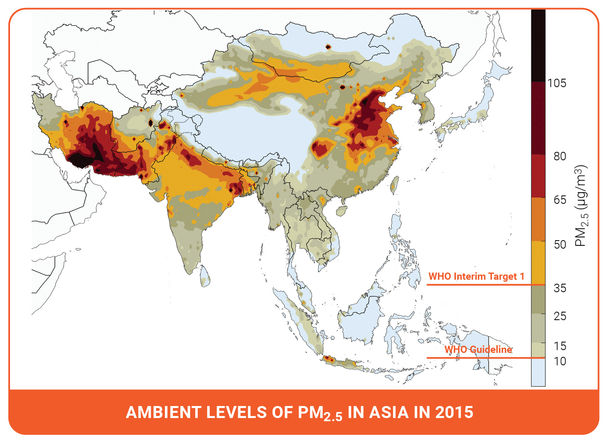

```{r setup, include=FALSE}
knitr::opts_chunk$set(echo = TRUE)
# Load all the packages needed here
library(tidyverse)
library(readr)
library(gt)
library(tufte)

# Set your file path here! Or, set this up as an .Rproj if you'd like.
rootdir <- ("~/Dropbox/Teaching/UCSB/EDS_222/EDS222_data")
#rootdir <- ("~/Dropbox/EDS222_data")
datadir <- file.path(rootdir,"data","01-week-one")
setwd(file.path(rootdir,"homework","week-one"))
```

_(The case study in this exercise is based on reality, but does not include actual observational data.)_


# Air Pollution in Lahore, Pakistan 

```{r, out.width = "100%", echo=FALSE, fig.margin=TRUE}

```

In this exercise we will look at a case study concerning air quality in South Asia. The World Health Organization estimates that air pollution kills an estimated seven million people per year, due to its effects on the cardiovascular and respiratory systems. Out of the 40 most polluted cities in the world, South Asia is home to 37, and Pakistan was ranked to contain the second most air pollution in the world in 2020 (IQAIR, 2020). In 2019, Lahore, Pakistan was the 12th most polluted city in the world, exposing a population of 11.1 million people to increased mortality and morbidity risks. 

In this exercise, you are given two datasets^[All data for EDS 222 will be stored on the Taylor server, in the shared `/courses/EDS222/data/` directory. Please see material from EDS 214 on how to access and retrieve data from Taylor. These data are small; all compute can be handled locally.] from Lahore, Pakistan and are asked to compare the two different data collection strategies from this city. These data are:

- Crowd-sourced data from air quality monitors located in people's homes. These data are voluntarily collected by individual households who choose to install a monitor in their home and upload their data for public access. 

- Official government data from monitors installed by government officials at selected locations across Lahore. There have been reports that government officials strategically locate monitors in locations with cleaner air in order to mitigate domestic and international pressure to clean up the air. 

In answering the following questions, please consider the lecture content from class on sampling strategies, as well as the material in Chapter 2 of [_Introduction to Modern Statistics_](https://openintro-ims.netlify.app/). Include in your submission an `.Rmd` file and a compiled `.html` file, each containing complete answers to all questions (as well as all your code in the `.Rmd`). 

## Question 1: 

Load the data from each source and label it as `crowdsourced` and `govt` accordingly. For example: 

```{r}
crowdsourced <- readRDS(file.path(datadir,"airpol-PK-crowdsourced.RDS"))
govt <- readRDS(file.path(datadir, "airpol-PK-govt.RDS"))
```
1. These dataframes have one row per pollution observation. How many pollution records are in each dataset? 

```{r}
dim(crowdsourced)
dim(govt)
```
**The crowdsourced data have 5,488 records and the government data have 1,960 records.**

2. Each monitor is located at a unique latitude and longitude location. How many unique monitors are in each dataset?^[**Hint:** `group_by(longitude,latitude)` and `cur_group_id()` in `dplyr` will help in creating a unique identifier for each (longitude, latitude) pair.]

```{r}
govt = govt %>% group_by(longitude,latitude) %>%
  mutate(ID = cur_group_id())
crowdsourced = crowdsourced %>% group_by(longitude,latitude) %>%
  mutate(ID = cur_group_id())

length(unique(govt$ID))
length(unique(crowdsourced$ID))
```
**There are 5 monitors in the government data and 14 in the crowdsourced data.**

## Question 2:

The goal of pollution monitoring in Lahore is to measure the average pollution conditions across the city.

1. What is the _population_ in this setting? Please be precise.

**Air pollution at every location across the entire city of Lahore over a given time period.**

2. What are the _samples_ in this setting? Please be precise.

**There are two samples. First, the crowdsourced data represent a sample of locations based on where volunteer data collectors choose to report readings. For each location, we have one reading per day from November 04, 2018 to November 30, 2019. Second, the official government data are a sample of five monitors across the city, again reporting daily over this same time period.**

3. These samples were not randomly collected from across locations in Lahore. Given the sampling approaches described above, discuss possible biases that may enter when we use these samples to construct estimates of population parameters.   

**Non-random collection of samples can introduce a variety of biases. These biases are correlated with the way non-random sampling is conducted. For example, government officials may have an incentive to place monitors in locations that are relatively clean, to make the city appear less polluted. This could bias our estimates of the population average pollution down, by making it appear that pollution in Lahore is cleaner than it actually is on average. In contrast, volunteers who are choosing to report their pollution levels may do so only because they are noticing that pollution is quite bad and they want the information to reach the public and potentially policymakers. This might bias their pollution measures up, making pollution look worse on average than it is in the population. In contrast, it is also possible that the high cost of air quality monitoring could lead to crowd sourced monitors being placed only in wealthier areas of the city which would may have lower levels of pollution. A priori, it's hard to say exactly which way these biases might go, but it seems likely these are not randomly sampled locations across the city.**

## Question 3: 

1. For both the government data and the crowd-sourced data, report the sample mean, sample minimum, and sample maximum value of PM 2.5 (measured in $\mu g/m^3$). 

```{r, include = TRUE, fig.margin = TRUE}
govt %>% 
   group_by() %>% summarise(PM_mean=mean(PM, na.rm=T),
                            PM_min=min(PM, na.rm=T),
                            PM_max=max(PM, na.rm=T)) %>%
  gt()
```

```{r, include = TRUE, fig.margin = TRUE}
crowdsourced %>% 
   group_by() %>% summarise(PM_mean=mean(PM, na.rm=T),
                            PM_min=min(PM, na.rm=T),
                            PM_max=max(PM, na.rm=T)) %>%
  gt()
```

2. Discuss any key differences that you see between these two samples. 

**The government data has a lower mean (~50% of the crowd sourced) and a lower minimum and maximum, suggesting the entire distribution gives smaller PM levels.**

3. Are the differences in mean pollution as expected, given what we know about the sampling strategies?

**As discussed above, it's possible that government officials strategically locate monitors in locations with cleaner air, and that people living in highly polluted areas may choose to participate in a crowd-sourcing program. The higher levels of pollution in the crowdsourced data are consistent with these suspected sources of non-random sampling.**

## Question 4: 

Use the location of the air pollution stations for both of the sampling strategies to generate a map showing locations of each observation. Color the two samples with different colors to highlight how each sample obtains measurements from different parts of the city.^[**Hint:** `longitude` indicates location in the _x_-direction, while `latitude` indicates location in the _y_-direction. With `ggplot2` this should be nothing fancy. We'll do more spatial data in `R` later in the course.] 


```{r, include = TRUE, out.width = "100%", echo = FALSE, fig.margin = TRUE}

# Note: you could use two ggplot commands here instead of combining datasets into one data frame
comb = crowdsourced %>% mutate(type="crowdsourced") %>% 
  bind_rows(govt %>% mutate(type="govt"))

ggplot(data = comb,
  aes(x = longitude, y = latitude, color = type)) +
  geom_point(size=6) +
  theme_bw() + ggtitle("Q4: Map of pollution monitors in Lahore") 

```

## Question 5: 

The local newspaper in Pakistan, _Dawn_, claims that the government is misreporting the air pollution levels in Lahore. Do the locations of monitors in question 4, relative to crowd-sourced monitors, suggest anything about a possible political bias? 

**We can see that the coral dots that show government data sources are very few and concentrated in a very small radius whereas the crowdsourced data are more data points and also are spread out across the city. The government data represents air quality for a very small portion of the city and the crowsourced data has more representative data across the city. Hence, we can say that a political bias might exist in the government data.**

## Question 6:

Given the recent corruption in air quality reporting, the Prime Minister of Pakistan has hired an independent body of  environmental data scientists to create an unbiased estimate of the mean PM 2.5 across Lahore using some combination of both government stations and crowd sourced observations. 

NASA's satellite data indicates that the average PM across Lahore is 89.2 $\mu g/m^3$. Since this is the most objective estimate of population-level PM 2.5 available, your goal is to match this mean as closely as possible by creating a new ground-level monitoring sample that draws on both the government and crowd-sourced samples. 

### Question 6.1: 

First, generate a _random sample_ of size $n=1000$ air pollution records by (i) pooling observations across the government and the crowd-sourced data;^[**Hint:** `bind_rows()` may be helpful.] and (ii) drawing observations at random from this pooled sample. 

```{r, include = TRUE, eval = TRUE}
# pool observations and draw a random sample
# note that I already pooled the sample above in Q4 -- if you didn't, you first need to bind_rows() here
set.seed(2985)
randsample <- comb %>% group_by() %>%
  slice_sample(n=1000)

# confirm we've got just 1000 rows
dim(randsample)
```

Second, create a _stratified random sample_. Do so by (i) stratifying your pooled data-set into strata of 0.01 degrees of latitude, and (ii) randomly sampling 200 air pollution observations from each stratum. 

```{r, include = TRUE, eval = TRUE}
# create stratification groupings: every 0.01 degrees latitude
comb <- comb %>% mutate(latr = round(latitude, digits = 2)) 

# sample each group 200 times
stratsample <- comb %>% group_by(latr) %>% slice_sample(n=200)

# confirm we've got 5*200 = 1000 rows
dim(stratsample)
```

### Question 6.2:

Compare estimated means of PM 2.5 for each sampling strategy to the NASA estimate of 89.2 $\mu g/m^3$. Which sample seems to match the satellite data best? What would you recommend the Prime Minister do? Does your proposed sampling strategy rely more on government or on crowd-sourced data? Why might that be the case?  

**Both samples are quite inaccurate. The stratified sample gets us slightly closer to the satellite-based measure, since its 65 $\mu g/m^3$ mean is higher than the random sample's mean of about 62 $\mu g/m^3$. However, both are substantially too low. In the stratified sample, most observations come from crowdsourced data, as opposed to government data: about 840 of the 1,000 records are from crowdsourced data.**

```{r, include = TRUE, eval = TRUE}
# table for the random sample
randsample %>% 
   group_by() %>% summarise(PM_mean=mean(PM, na.rm=T),
                            PM_min=min(PM, na.rm=T),
                            PM_max=max(PM, na.rm=T)) %>%
  gt()

# table for the stratified sample
stratsample %>% 
   group_by() %>% summarise(PM_mean=mean(PM, na.rm=T),
                            PM_min=min(PM, na.rm=T),
                            PM_max=max(PM, na.rm=T)) %>%
  gt()

# how much of the stratified sample comes from govt data vs crowdsourced?
stratsample %>% group_by(type) %>% count() %>% gt()

```
